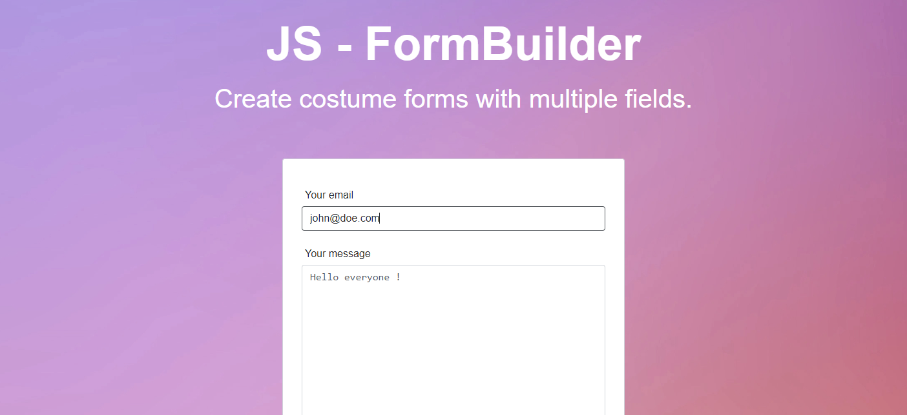

<div align="center">
    
</div>

### Features


### Install

```javascript
import { FormBuilder } from "./modules/formBuilder.js";

const form = new FormBuilder({
  form : {
      /* required form options
          class, id, method, action, etc...
      */
  },
  options : {
    // options ....
    // output, 
    // surrond { class, id, etc..} - default false
  }

})

```
### Getting Started

**Download** the script file clicking [here](https://github.com/caa-pjt/form-validator/tree/main/dist/formValidator.min.js)

### Quickstart

1. Create class instance and declare the default options
```javascript
const form = new FormBuilder({
  form : {
      class : 'form', 
      id : 'form-id', 
      method : "POST", 
      action :""
  },
  options : {
      output : "#app", // HTML querySelector
      surround : {
          class : "row g-3" // Surrond the input and the label with a div class
      }
  }

})
```

- Default Form options 

```javascript
formOptions = {
    method : "GET",
    action : "#",
}
```

- Default options

```javascript
options = {
    output : null 
    surround : false
}
```
## Methodes
> Name: **addFields**
>
> Creation of form inputs
>
> array[
>   { field 1 },
>   { field 2 },
>   { field 3 }
>]
```javascript
form.addFields(
  [
    {
        field_type : // "input, select, textarea, button",
        required : // true|false,
        label : // "text of the label",
        type : // 'email, week, submit, date, password, etc...', 
        name : // 'name of the input', - required 
        placeholder : // "john@doe.com",
        value : "",
        options: {} // Used on field_type : select
    }
  ]
```

> Name: **appendIn**
>
> Append the form to the view 

```javascript
  form.appendIn('html querySelector')
```


### Exemple 

- Javascript (input)
```javascript 
  form.addFields([
    {
        field_type : "input",
        required : false,
        label : "Your email",
        type : 'email', 
        name : 'email', 
        placeholder : "john@doe.com",
        value : "",
        options: {} 
    },
    {
        field_type : "textarea",
        required : true,
        name : 'textarea', 
        placeholder : 'Ask your question', 
        rows : 10, 
        label : "Your message",
        text : "Hello everyone !"
    },
    {
        field_type : "select", 
        name: "animal",
        id: "select-id",
        label: "Choose an option",
        options: {
            values: {
                "option-1": "Option 1",
                "option-2": "Option 2",
                "option-3": "Option 3",
            },
            default: "--- Options ---"
        }
    },
    {
        field_type : "button",
        type : 'submit', 
        class : 'btn btn-primary', 
        text : 'Submit'
    }
  ])

```
- HTML (Output)
```html

  <form class="form" id="form-id" method="POST" action="">
    <div class="row g-3" data-for="email">
      <label for="email">Your email</label>
      <input required="false" type="email" name="email" placeholder="john@doe.com" value="" id="email">
    </div>
    <div class="row g-3" data-for="textarea">
      <label for="textarea">Your message</label>
      <textarea required="true" name="textarea" placeholder="Ask your question" rows="10" id="textarea">Hello everyone !</textarea>
    </div>
    <div class="row g-3" data-for="select-id">
      <label for="select-id">Choose an option</label>
      <select name="animal" id="select-id">
        <option value="">--- Options ---</option>
        <option value="option-1">Option 1</option>
        <option value="option-2">Option 2</option>
        <option value="option-3">Option 3</option>
      </select>
    </div>
    <div class="row g-3" data-for="null">
      <button type="submit" class="btn btn-primary">Submit</button>
    </div>
  </form>
```